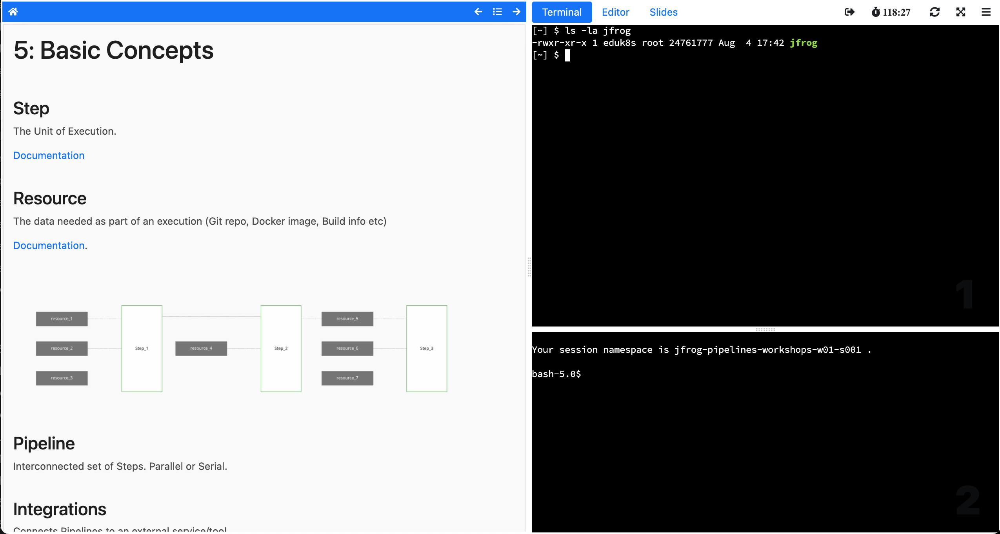

Workshop - JFrog Pipelines Fundamentals Labs
=============================

This is the content for a workshop lab built to run with the [Edukates platform](https://docs.edukates.io/).

---



---

### How to run it

#### Pre-requisites

1. A Kubernetes cluster (local or on the cloud)

2. A Kubernetes Ingress Controller deployed to your cluster 

   - [Contour](https://projectcontour.io/getting-started/) or 

   - [Nginx](https://kubernetes.github.io/ingress-nginx/deploy)

3. Configure the Edukates Operators 
   
   [Documentation](https://docs.edukates.io/en/latest/getting-started/installing-operator.html).

   e.g. `kubectl apply -k "github.com/eduk8s/eduk8s?ref=21.05.10.1"`

---

#### Deploy the workshop and training portal

1. Clone this repository locally 

2. Edit the following lines of file `config/jfrog-pipelines-portal.yml`:

    ```
    password: PORTAL_PASSWORD_GOES_HERE   # replace with your own portal password
    ingress:
      domain: edu.workshops.zone    # replace with your own base domain
      hostname: jfrog               # replace with the desired sub-domain for the workshop url
      class: contour                # either contour or nginx 
    ```

3. Deploy the workshops and the training portal to Kubernetes 

    ```
    cd config 
    kubectl apply -f jfrog-pipelines-intro-workshop.yml
    kubectl apply -f jfrog-pipelines-stepbystep-workshop.yml
    kubectl apply -f jfrog-pipelines-portal.yml 
    ```

4. Give it a few seconds to initialize the pods and then check if the training portal is up and running:

    `kubectl get trainingportals`

    That command should return the url of the training portal along with its admin credentials. 

    To access the training portal, access the url and enter the portal password configured in step 2 above.

    To access the admin pages of the portal, access `<url>/admin` and enter the admin credentials returned by the command above.

---


