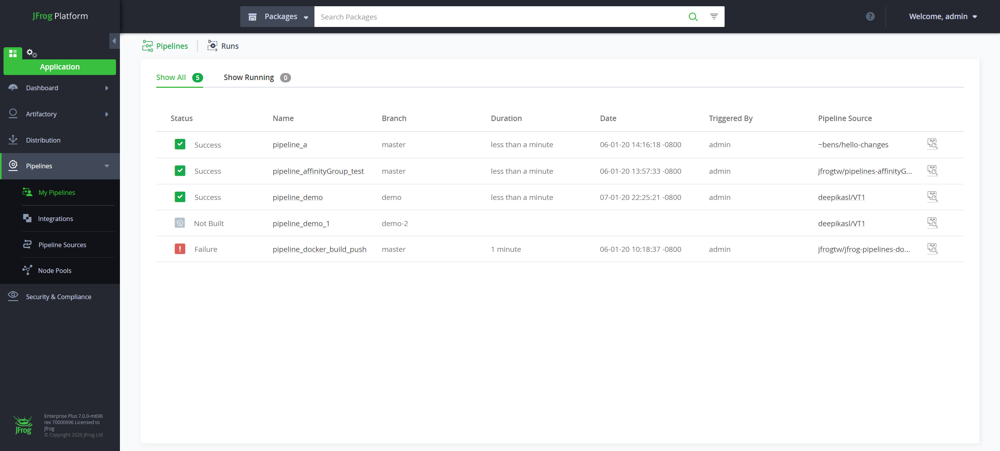
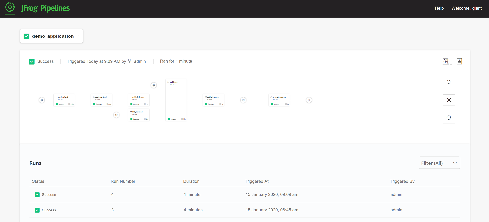

<!-- ### Pipelines Overview -->

JFrog Pipelines is an Enterprise-ready, Universal CI & CD platform that provides:

- end-to-end automation (CI/CD)
- workflow and tool orchestration
- optimization of the JFrog toolset functionality in use

[Documentation](https://www.jfrog.com/confluence/display/JFROG/JFrog+Pipelines)

 

### Workflow Automation

A pipeline is an event-driven automated workflow for executing a set of DevOps activities. It is composed of a sequence of interdependent steps and resources.

 

---